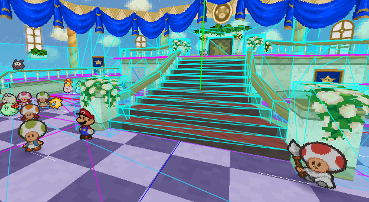
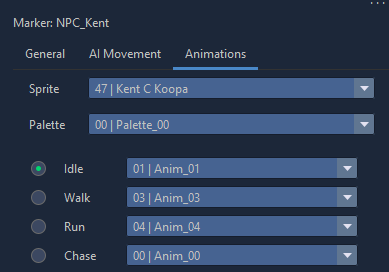
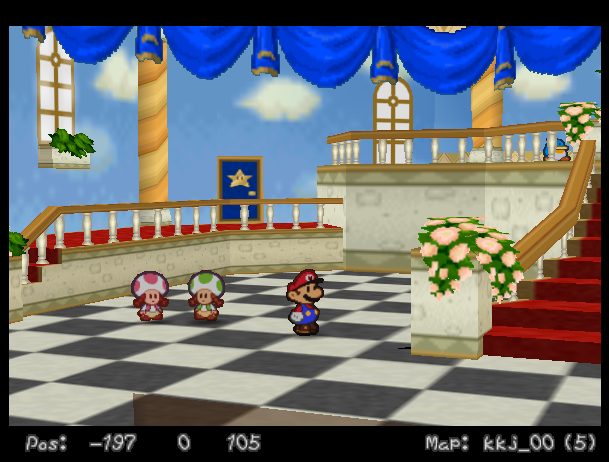

# Creating NPCs

This guide assumes you've followed the [Basic patching](PATCHING.md) guide.

Creating NPCs is a bit of a lengthy process, but it's by no means difficult. In this tutorial I am going to show you how to do it by adding an NPC to an existing map (the process is exactly the same for a custom map, if you were wondering). For convenience, the NPC will be added to the first map in the game where Mario is given control, which is the Entry Hall of Peach's Castle. The engine name for this map is kkj_00. 

## Placing the NPC in the map
Open kkj_00.xml in the map editor, and think about where you want to place the NPC. Once you've found a good spot, hold down middle click and move Mario to that position in the 3D view. I am going to place the NPC as seen below, where Mario is standing.



On the right side of the Map Editor, go into the Markers tab. Click *Create*, then *New Marker*. A window will pop up. In the window, give your marker a name, set the type to *NPC*, and click OK. When you select the marker you've just created, a menu appears in the bottom right corner of the map editor. In this menu, click on the Animations tab. Here you can set the spritesheet you want your NPC to use, as well as its palette and basic animations. I decided to use Kent C Koopa, because he stands out among the other NPCs in this map. 



If you want, you can also give the NPC some basic movement in the AI Movement tab.

When you're done, save the map by pressing Ctrl+S. The NPC now has a position on the map, but if you compile and run the game now you'll notice he's not actually there. 



This is because we haven't told the game to actually place an NPC here yet.

## Creating the NPC with code
Create a patch file for this map. You can do this from the map editor by clicking the Scripts tab in the top right, then clicking the Create Patch File button. After that you can click the Open Patch File button to immediately open the file in a text editor.

### The NpcGroup
In terms of code, the basis for any NPC is an NpcGroup. This is the first thing we're going to create, and I'm going to do it by copying one from the map on which Kent C Koopa originally appears. If you're making an NPC based on one that already exists in a different map, this is the recommended way to do it.

```
#new:NpcGroup $NpcGroup_KentCKoopa
{
	0000003F $NpcSettings_KentCKoopa ~Vec3f:NPC_Kent % -164 0 -37
	00002D01 $Script_Init_KentCKoopa 00000000 00000000 0000010E
	~NoDrops
	~Movement:NPC_Kent
	~AnimationTable:NPC_Kent % .Sprite:KentCKoopa
	00000000 00000000 00000000 00000000 % no tattle string
}
```

But what does all this mean? If you followed the patching tutorial, the `#new:NpcGroup $NpcGroup_KentCKoopa` should at least look familiar. The name of the data structure (specified after the `$`) can be anything, as long as you reference it correctly later. Inside the NpcGroup, there's quite a few sets of numbers, and I'm going to go through what they mean one by one.

- `0000003F` - The NPC index. Make sure no other NPC on the map has the same index as your new NPC. Since kkj_00 already has so many NPCs, I set this to 3F just to be safe.
- `$NpcSettings_KentCKoopa` - The name of the NPC's NpcSettings structure. We'll create one of these later.
- `~Vec3f:NPC_Kent` - A reference to the marker you made earlier, make sure the marker name matches what you put after the colon here.
- `00B44D04` - NPC flags. Each flag has a certain functionality associated with it. A complete list of what these flags do can be found in the Paper Mario decomp (the NpcFlags enum). If you're copying an NPC from a different map, just leave this unchanged (for Kent C Koopa I ended up changing this to the flags used by a Toad because Kent's flags weren't working right). If you're making a new NPC and you're not sure how to use these flags, just copy them from an NPC that looks and behaves similar to yours.
- `$Script_Init_KentCKoopa` - The name of the NPC's Init script. We'll create one of these later.
- `00000000` - "initVarCount", just leave it at 0.
- `00000000` - "initVar", just leave it at 0.
- `0000010E` - Initial world yaw, or the rotation the NPC will have when it's spawned. If unsure, set this to 0.
- `~NoDrops` - Enemy drops after a battle. If your NPC is friendly, leave this at `~NoDrops`, otherwise look at enemy NpcGroups in the source files to see how to set up drops.
- `~Movement:NPC_Kent` - Movement data as defined in the "AI Movement" tab of the NPC marker in the map editor. Make sure the marker name matches what you put after the colon here. If you want your NPC to move around instead of just standing still the whole time, you can set up basic movement in this tab.
- `~AnimationTable:NPC_Kent` - A reference to the Animation tab of the NPC's marker. Once again, make sure the marker name matches what you put after the colon here.
- The purpose of the next three sets of numbers is unknown.
- `00000000` - Reference to a tattle string defined in "1A NPC Tattles.str".  <!-- TODO test this  -->


### The NpcSettings
Up next, create the NPC Settings. Once again I recommend copying this data from a similar (or identical) NPC from a different map.

```
#new:NpcSettings $NpcSettings_KentCKoopa
{
	00000000 00440050 00000000 00000000 00000000 80077F70 00000000 8007809C
	00000000 00000000 00630000
}
```
(Make sure the name matches the name you gave it in the NpcGroup.)

Again there are a bunch of vague sets of numbers, but this time I am not going to explain what they all do in detail. There's only one set of numbers you need to be concerned with for now, and it's the second (in this example, it's the `00440050`). This set of numbers defines the NPC's collision. The first four digits define the NPC's height (and also the height of the talk icon that appears above their head when Mario gets close), the last four define the radius. If you want to know what all the other sets of numbers do, look in the decomp (the NpcSettings struct).


### The init script
Now create an init script for the NPC.

```
#new:Script $Script_Init_KentCKoopa
{
    Return
    End
}
```
(Once again, make sure the name matches the name of the script in the NpcGroup.)

In this script, we tell the game what to do when the NPC is first created. The main purpose of this script is to define NPC behaviour for certain situations. There are six types of behaviour scripts to define here.

- Aux
- Idle (runs every frame when the player is within a certain distance)
- AI
- Interact
- Hit
- Defeat

Generally, the only ones you will need are Idle, Interact and Defeat. For this NPC, only an Interact is necessary. Add an Interact script to the Init script as follows:

```
#new:Script $Script_Init_KentCKoopa
{
    Call BindNpcInteract ( .Npc:Self $Script_Interact_KentCKoopa )
    Return
    End
}
```
(`.Npc:Self` refers to the NPC this script is attached to)

### The interact script
Of course, this means you now have to create another script to define the Interact behaviour.

```
#new:Script $Script_Interact_KentCKoopa
{
    Return
    End
}
```

The code in this script will run when the player approaches the NPC and presses A. Most NPCs will just talk to Mario, and nothing else.

To make the NPC speak, use the SpeakToPlayer function.

```
#new:Script $Script_Interact_KentCKoopa
{
    Call SpeakToPlayer ( .Npc:Self 00470002 00470001 00000000 000C012D )
    Return
    End
}
```

The arguments for this function (the things between the braces) are:
1. The index of the NPC saying the dialogue
2. The NPC's talk animation
3. The NPC's idle animation
4. Message flags (just leave this at 0)
5. The string to say (I'm using the dialogue he uses in the original map)

## Modifying the NpcGroupList

Now the NPC itself is done, but the game still doesn't place it on the map. NPC's are created with the MakeNpcs function, which creates every NPC in the NpcGroupList you provide as an argument. In order for your new NPC to be created, you need to add it to the correct NpcGroupList.

If you look in kkj_00.mscr, you'll find that there's more than one NpcGroupList in the file. To find out which list you need to modify, check the NpcGroups in each list to see if they contain the NPCs you see when you enter the castle at the start of the game. Patch that NpcGroupList (refer to [Basic Patching](PATCHING.md)), and add the new NpcGroup below the last one in the list.

An NpcGroupList entry has three parts:
1. The amount of NPCs in the Group (in this case, that's just 1)
2. The name of the NpcGroup
3. The battle associated with the NpcGroup (`00000000` if there's no associated battle). This follows the format AAAABBCC, where
   - AAAA = the battle area
   - BB = the formation
   - CC = the stage index

```
@ $NpcGroupList_802439C4 {
    0000000B $NpcGroup_80242474 00000000
    00000001 $NpcGroup_KentCKoopa 00000000
    00000000 00000000 00000000
}
```
(Make sure to leave that line of 0s at the bottom of the list, it tells the game where the list ends.)

Of course, if you're adding a custom NPC to a new map, you need to create the NpcGroupList from scratch (with `#new:`) instead of patching it, and you'll also need to add a `MakeNpcs` call to your map's $Script_Main. To see how that function works, look at the code of any map with NPCs on it.

Compile the game, and your NPC should now appear in the map!
